# Wine Quality Data Analysis

https://archive.ics.uci.edu/ml/datasets/Wine+Quality

Citation Request:
  This dataset is public available for research. The details are described in [Cortez et al., 2009].
  Please include this citation if you plan to use this database:

  P. Cortez, A. Cerdeira, F. Almeida, T. Matos and J. Reis.
  Modeling wine preferences by data mining from physicochemical properties.
  In Decision Support Systems, Elsevier, 47(4):547-553. ISSN: 0167-9236.

  Available at: [@Elsevier] http://dx.doi.org/10.1016/j.dss.2009.05.016
                [Pre-press (pdf)] http://www3.dsi.uminho.pt/pcortez/winequality09.pdf
                [bib] http://www3.dsi.uminho.pt/pcortez/dss09.bib

1. Title: Wine Quality

2. Sources
   Created by: Paulo Cortez (Univ. Minho), Antonio Cerdeira, Fernando Almeida, Telmo Matos and Jose Reis (CVRVV) @ 2009

3. Past Usage:

  P. Cortez, A. Cerdeira, F. Almeida, T. Matos and J. Reis.
  Modeling wine preferences by data mining from physicochemical properties.
  In Decision Support Systems, Elsevier, 47(4):547-553. ISSN: 0167-9236.

  In the above reference, two datasets were created, using red and white wine samples.
  The inputs include objective tests (e.g. PH values) and the output is based on sensory data
  (median of at least 3 evaluations made by wine experts). Each expert graded the wine quality
  between 0 (very bad) and 10 (very excellent). Several data mining methods were applied to model
  these datasets under a regression approach. The support vector machine model achieved the
  best results. Several metrics were computed: MAD, confusion matrix for a fixed error tolerance (T),
  etc. Also, we plot the relative importances of the input variables (as measured by a sensitivity
  analysis procedure).

4. Relevant Information:

   The two datasets are related to red and white variants of the Portuguese "Vinho Verde" wine.
   For more details, consult: http://www.vinhoverde.pt/en/ or the reference [Cortez et al., 2009].
   Due to privacy and logistic issues, only physicochemical (inputs) and sensory (the output) variables
   are available (e.g. there is no data about grape types, wine brand, wine selling price, etc.).

   These datasets can be viewed as classification or regression tasks.
   The classes are ordered and not balanced (e.g. there are munch more normal wines than
   excellent or poor ones). Outlier detection algorithms could be used to detect the few excellent
   or poor wines. Also, we are not sure if all input variables are relevant. So
   it could be interesting to test feature selection methods.

5. Number of Instances: red wine - 1599; white wine - 4898.

6. Number of Attributes: 11 + output attribute

   Note: several of the attributes may be correlated, thus it makes sense to apply some sort of
   feature selection.

7. Attribute information:

   For more information, read [Cortez et al., 2009].

   Input variables (based on physicochemical tests):
   1 - fixed acidity
   2 - volatile acidity
   3 - citric acid
   4 - residual sugar
   5 - chlorides
   6 - free sulfur dioxide
   7 - total sulfur dioxide
   8 - density
   9 - pH
   10 - sulphates
   11 - alcohol
   Output variable (based on sensory data):
   12 - quality (score between 0 and 10)

8. Missing Attribute Values: None

# content of the current directory:


```python
% ls
```

    Readme.md                    winequality-red.csv
    Wine Quality Analysis.ipynb  winequality-white.csv
    Wine+Quality+Analysis.html   winequality.names.txt


```python
# import libs
%matplotlib inline
import pandas as pd
import seaborn as sns; sns.set(style="whitegrid", palette="muted")
import numpy as np
import matplotlib.pyplot as plt
```

### Create DataFrames for white and red wines


```python
white_wine_df = pd.read_csv('winequality-white.csv', sep=";")
red_wine_df = pd.read_csv('winequality-red.csv', sep=";")
```

### DataFrames for red and white wines combined


```python
ww = white_wine_df.loc[:]
ww["color"] = "white"
rw = red_wine_df.loc[:]
rw["color"] = "red"
wine_df = pd.concat([ww, rw], ignore_index=True)
```

# Data


```python
white_wine_df.head()
```


<div>
<table border="1" class="dataframe">
  <thead>
    <tr style="text-align: right;">
      <th></th>
      <th>fixed acidity</th>
      <th>volatile acidity</th>
      <th>citric acid</th>
      <th>residual sugar</th>
      <th>chlorides</th>
      <th>free sulfur dioxide</th>
      <th>total sulfur dioxide</th>
      <th>density</th>
      <th>pH</th>
      <th>sulphates</th>
      <th>alcohol</th>
      <th>quality</th>
      <th>color</th>
    </tr>
  </thead>
  <tbody>
    <tr>
      <th>0</th>
      <td>7.0</td>
      <td>0.27</td>
      <td>0.36</td>
      <td>20.7</td>
      <td>0.045</td>
      <td>45.0</td>
      <td>170.0</td>
      <td>1.0010</td>
      <td>3.00</td>
      <td>0.45</td>
      <td>8.8</td>
      <td>6</td>
      <td>white</td>
    </tr>
    <tr>
      <th>1</th>
      <td>6.3</td>
      <td>0.30</td>
      <td>0.34</td>
      <td>1.6</td>
      <td>0.049</td>
      <td>14.0</td>
      <td>132.0</td>
      <td>0.9940</td>
      <td>3.30</td>
      <td>0.49</td>
      <td>9.5</td>
      <td>6</td>
      <td>white</td>
    </tr>
    <tr>
      <th>2</th>
      <td>8.1</td>
      <td>0.28</td>
      <td>0.40</td>
      <td>6.9</td>
      <td>0.050</td>
      <td>30.0</td>
      <td>97.0</td>
      <td>0.9951</td>
      <td>3.26</td>
      <td>0.44</td>
      <td>10.1</td>
      <td>6</td>
      <td>white</td>
    </tr>
    <tr>
      <th>3</th>
      <td>7.2</td>
      <td>0.23</td>
      <td>0.32</td>
      <td>8.5</td>
      <td>0.058</td>
      <td>47.0</td>
      <td>186.0</td>
      <td>0.9956</td>
      <td>3.19</td>
      <td>0.40</td>
      <td>9.9</td>
      <td>6</td>
      <td>white</td>
    </tr>
    <tr>
      <th>4</th>
      <td>7.2</td>
      <td>0.23</td>
      <td>0.32</td>
      <td>8.5</td>
      <td>0.058</td>
      <td>47.0</td>
      <td>186.0</td>
      <td>0.9956</td>
      <td>3.19</td>
      <td>0.40</td>
      <td>9.9</td>
      <td>6</td>
      <td>white</td>
    </tr>
  </tbody>
</table>
</div>


```python
red_wine_df.head()
```


<div>
<table border="1" class="dataframe">
  <thead>
    <tr style="text-align: right;">
      <th></th>
      <th>fixed acidity</th>
      <th>volatile acidity</th>
      <th>citric acid</th>
      <th>residual sugar</th>
      <th>chlorides</th>
      <th>free sulfur dioxide</th>
      <th>total sulfur dioxide</th>
      <th>density</th>
      <th>pH</th>
      <th>sulphates</th>
      <th>alcohol</th>
      <th>quality</th>
      <th>color</th>
    </tr>
  </thead>
  <tbody>
    <tr>
      <th>0</th>
      <td>7.4</td>
      <td>0.70</td>
      <td>0.00</td>
      <td>1.9</td>
      <td>0.076</td>
      <td>11.0</td>
      <td>34.0</td>
      <td>0.9978</td>
      <td>3.51</td>
      <td>0.56</td>
      <td>9.4</td>
      <td>5</td>
      <td>red</td>
    </tr>
    <tr>
      <th>1</th>
      <td>7.8</td>
      <td>0.88</td>
      <td>0.00</td>
      <td>2.6</td>
      <td>0.098</td>
      <td>25.0</td>
      <td>67.0</td>
      <td>0.9968</td>
      <td>3.20</td>
      <td>0.68</td>
      <td>9.8</td>
      <td>5</td>
      <td>red</td>
    </tr>
    <tr>
      <th>2</th>
      <td>7.8</td>
      <td>0.76</td>
      <td>0.04</td>
      <td>2.3</td>
      <td>0.092</td>
      <td>15.0</td>
      <td>54.0</td>
      <td>0.9970</td>
      <td>3.26</td>
      <td>0.65</td>
      <td>9.8</td>
      <td>5</td>
      <td>red</td>
    </tr>
    <tr>
      <th>3</th>
      <td>11.2</td>
      <td>0.28</td>
      <td>0.56</td>
      <td>1.9</td>
      <td>0.075</td>
      <td>17.0</td>
      <td>60.0</td>
      <td>0.9980</td>
      <td>3.16</td>
      <td>0.58</td>
      <td>9.8</td>
      <td>6</td>
      <td>red</td>
    </tr>
    <tr>
      <th>4</th>
      <td>7.4</td>
      <td>0.70</td>
      <td>0.00</td>
      <td>1.9</td>
      <td>0.076</td>
      <td>11.0</td>
      <td>34.0</td>
      <td>0.9978</td>
      <td>3.51</td>
      <td>0.56</td>
      <td>9.4</td>
      <td>5</td>
      <td>red</td>
    </tr>
  </tbody>
</table>
</div>


```python
assert white_wine_df.columns.all() == red_wine_df.columns.all()
",".join(list(white_wine_df.columns))
```


    'fixed acidity,volatile acidity,citric acid,residual sugar,chlorides,free sulfur dioxide,total sulfur dioxide,density,pH,sulphates,alcohol,quality,color'


### test for null values and check correct datatypes


```python
assert white_wine_df.notnull().all().all()
white_wine_df.info()
```

    <class 'pandas.core.frame.DataFrame'>
    RangeIndex: 4898 entries, 0 to 4897
    Data columns (total 13 columns):
    fixed acidity           4898 non-null float64
    volatile acidity        4898 non-null float64
    citric acid             4898 non-null float64
    residual sugar          4898 non-null float64
    chlorides               4898 non-null float64
    free sulfur dioxide     4898 non-null float64
    total sulfur dioxide    4898 non-null float64
    density                 4898 non-null float64
    pH                      4898 non-null float64
    sulphates               4898 non-null float64
    alcohol                 4898 non-null float64
    quality                 4898 non-null int64
    color                   4898 non-null object
    dtypes: float64(11), int64(1), object(1)
    memory usage: 497.5+ KB


__no null values in white wine dataframe found__


```python
assert red_wine_df.notnull().all().all()
red_wine_df.info()
```

    <class 'pandas.core.frame.DataFrame'>
    RangeIndex: 1599 entries, 0 to 1598
    Data columns (total 13 columns):
    fixed acidity           1599 non-null float64
    volatile acidity        1599 non-null float64
    citric acid             1599 non-null float64
    residual sugar          1599 non-null float64
    chlorides               1599 non-null float64
    free sulfur dioxide     1599 non-null float64
    total sulfur dioxide    1599 non-null float64
    density                 1599 non-null float64
    pH                      1599 non-null float64
    sulphates               1599 non-null float64
    alcohol                 1599 non-null float64
    quality                 1599 non-null int64
    color                   1599 non-null object
    dtypes: float64(11), int64(1), object(1)
    memory usage: 162.5+ KB


__no null values in red wine dataframe found__

### All datatypes are numeric.

# Build categoricals


```python
# this can be crucial :)
white_wine_df["color"] = white_wine_df["color"].astype("category")
red_wine_df["color"] = red_wine_df["color"].astype("category")
wine_df["color"] = wine_df["color"].astype("category")
```

# Means

### White Wines:


```python
white_wine_df.mean()
```


    fixed acidity             6.854788
    volatile acidity          0.278241
    citric acid               0.334192
    residual sugar            6.391415
    chlorides                 0.045772
    free sulfur dioxide      35.308085
    total sulfur dioxide    138.360657
    density                   0.994027
    pH                        3.188267
    sulphates                 0.489847
    alcohol                  10.514267
    quality                   5.877909
    dtype: float64


### Red Wines:


```python
red_wine_df.mean()
```


    fixed acidity            8.319637
    volatile acidity         0.527821
    citric acid              0.270976
    residual sugar           2.538806
    chlorides                0.087467
    free sulfur dioxide     15.874922
    total sulfur dioxide    46.467792
    density                  0.996747
    pH                       3.311113
    sulphates                0.658149
    alcohol                 10.422983
    quality                  5.636023
    dtype: float64


#### Differences between red and white wine means that are greater than 1.0


```python
mean_diff = white_wine_df.mean() - red_wine_df.mean()
mean_diff_abs = mean_diff.apply(lambda x: abs(x))
mean_diff[mean_diff_abs >= 1.0]
```


    fixed acidity           -1.464850
    residual sugar           3.852609
    free sulfur dioxide     19.433163
    total sulfur dioxide    91.892865
    dtype: float64


# Distribution of Quality


```python
sns.countplot(data=white_wine_df, x="quality")
sns.plt.title("White Wines")
```


    <matplotlib.text.Text at 0x1112b1ac8>


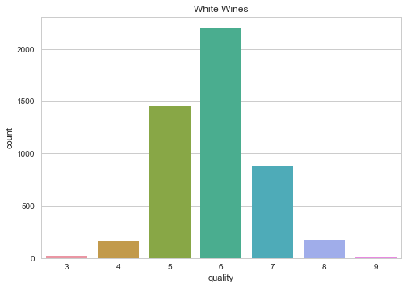


```python
white_wine_df.quality.describe()
```


    count    4898.000000
    mean        5.877909
    std         0.885639
    min         3.000000
    25%         5.000000
    50%         6.000000
    75%         6.000000
    max         9.000000
    Name: quality, dtype: float64


```python
x = sns.countplot(data=red_wine_df, x="quality")
sns.plt.title("Red Wines")
```


    <matplotlib.text.Text at 0x11144de80>


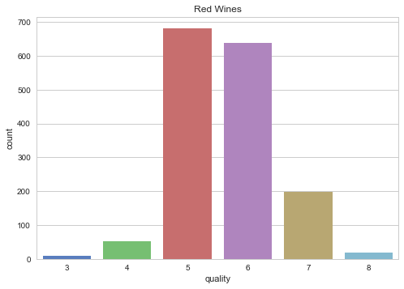


```python
red_wine_df.quality.describe()
```


    count    1599.000000
    mean        5.636023
    std         0.807569
    min         3.000000
    25%         5.000000
    50%         6.000000
    75%         6.000000
    max         8.000000
    Name: quality, dtype: float64


# What may be important for a high quality rating?

__To find out, the percentual mean differences for low quality to high quality wines over the total mean are calculated, resulting in percentual changes.__

## For white wines:


```python
x = white_wine_df.groupby(["quality"]).mean()
lower_quals = x.loc[:4].mean()
higher_quals = x.loc[7:].mean()
ww_perc_means = (higher_quals - lower_quals) / white_wine_df.mean() * 100
ww_perc_means
```


    alcohol                 14.068993
    chlorides              -38.372538
    citric acid              7.758984
    density                 -0.254610
    fixed acidity           -6.235608
    free sulfur dioxide    -10.177344
    pH                       1.934262
    quality                       NaN
    residual sugar          -8.100321
    sulphates                1.999155
    total sulfur dioxide   -18.439304
    volatile acidity       -27.979143
    dtype: float64


### Comparing low quality means to high quality ones, the following attributes differ more than 5 per cent:


```python
ww_perc_means[abs(ww_perc_means) > 5]
```


    alcohol                 14.068993
    chlorides              -38.372538
    citric acid              7.758984
    fixed acidity           -6.235608
    free sulfur dioxide    -10.177344
    residual sugar          -8.100321
    total sulfur dioxide   -18.439304
    volatile acidity       -27.979143
    dtype: float64


### Comparing low quality means to high quality ones, the following attributes differ more than 10 per cent:


```python
ww_perc_means[abs(ww_perc_means) > 10]
```


    alcohol                 14.068993
    chlorides              -38.372538
    free sulfur dioxide    -10.177344
    total sulfur dioxide   -18.439304
    volatile acidity       -27.979143
    dtype: float64


## For red wines:


```python
x = red_wine_df.groupby(["quality"]).mean()
lower_quals = x.loc[:4].mean()
higher_quals = x.loc[7:].mean()
rw_perc_means = (higher_quals - lower_quals) / red_wine_df.mean() * 100
rw_perc_means
```


    alcohol                 16.023546
    chlorides              -38.955960
    citric acid             77.707371
    density                 -0.134937
    fixed acidity            7.811538
    free sulfur dioxide     12.783852
    pH                      -3.345302
    quality                       NaN
    residual sugar          -0.609713
    sulphates               26.028988
    total sulfur dioxide     7.875629
    volatile acidity       -71.161438
    dtype: float64


### Comparing low quality means to high quality ones, the following attributes differ more than 5 per cent:


```python
rw_perc_means[abs(rw_perc_means) > 5]
```


    alcohol                 16.023546
    chlorides              -38.955960
    citric acid             77.707371
    fixed acidity            7.811538
    free sulfur dioxide     12.783852
    sulphates               26.028988
    total sulfur dioxide     7.875629
    volatile acidity       -71.161438
    dtype: float64


### Comparing low quality means to high quality ones, the following attributes differ more than 10 per cent:


```python
rw_perc_means[abs(rw_perc_means) > 10]
```


    alcohol                16.023546
    chlorides             -38.955960
    citric acid            77.707371
    free sulfur dioxide    12.783852
    sulphates              26.028988
    volatile acidity      -71.161438
    dtype: float64


# What will be taken a closer look at:

* Alcohol
* Chlorides
* Citric Acid
* Sulphates
* Sulfur Dioxides
* Volatile Acidity

# Sulfur Dioxides and Quality

### White Wines


```python
fig, (ax1, ax2) = plt.subplots(1,2)
fig.set_size_inches(14.5, 4.5)
fig.dpi = 300
sns.stripplot(data=white_wine_df, x="quality", y="total sulfur dioxide", jitter=True, ax=ax1)
sns.stripplot(data=white_wine_df, x="quality", y="free sulfur dioxide", jitter=True, ax=ax2)
```


    <matplotlib.axes._subplots.AxesSubplot at 0x114f6d4e0>


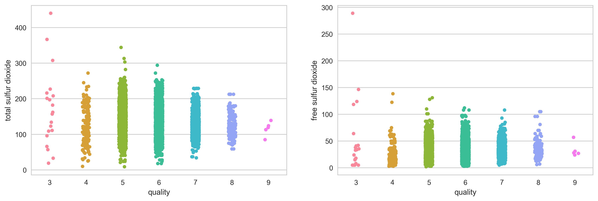


```python
high_qual_ww_tsd_mean = white_wine_df[white_wine_df["quality"] >= 7]["total sulfur dioxide"].mean()
high_qual_ww_tsd_mean = format(high_qual_ww_tsd_mean, '.1f')
print(f"The mean for higher quality white wines (quality >= 7) is {high_qual_ww_tsd_mean}")
```

    The mean for higher quality white wines (quality >= 7) is 125.2


### Interpretation White Wines

Both plots show, that higher quality white wines tend to have less total sulfur dioxide in it.

### red wine


```python
fig, (ax1, ax2) = plt.subplots(1,2)
fig.set_size_inches(14.5, 4.5)
fig.dpi = 300
sns.stripplot(data=red_wine_df, x="quality", y="total sulfur dioxide", jitter=True, ax=ax1)
sns.stripplot(data=red_wine_df, x="quality", y="free sulfur dioxide", jitter=True, ax=ax2)
```


    <matplotlib.axes._subplots.AxesSubplot at 0x114e00cc0>


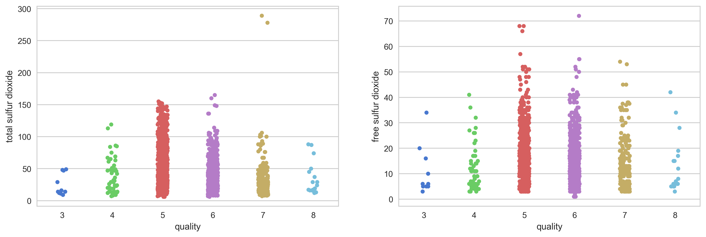


```python
high_qual_rw_tsd_mean = red_wine_df[red_wine_df["quality"] >= 7]["total sulfur dioxide"].mean()
high_qual_rw_tsd_mean = format(high_qual_rw_tsd_mean, '.1f')
print(f"The mean for higher quality red wines (quality >= 7) is {high_qual_rw_tsd_mean}")
```

    The mean for higher quality red wines (quality >= 7) is 34.9


## Interpretation Red Wines

For the red wines, there are much lower concentrations of sulfur dioxides. Additionally, there seems to be no direct correlation between sulfur dioxide concentration and percepted quality.

# Conclusion: Sulfur Dioxides and Quality

Regarding high quality white wines (>= 7), those wines have a mean of sulfur dioxides of around 125. Respectively high quality Red Wines (>=7) have a mean concentration of sulfur dioxide of 35.

# Sulphates and Quality


```python
sns.stripplot(data=wine_df, x="quality", y="sulphates", jitter=True, hue="color", split=True)
```


    <matplotlib.axes._subplots.AxesSubplot at 0x117849240>


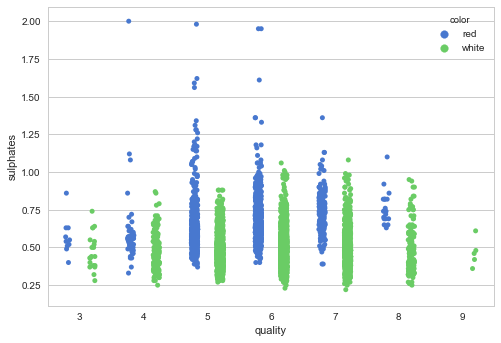


## Alcohol in Wine

### White Wine


```python
white_wine_df.groupby("quality")["alcohol"].describe()
```


<div>
<table border="1" class="dataframe">
  <thead>
    <tr style="text-align: right;">
      <th></th>
      <th>count</th>
      <th>mean</th>
      <th>std</th>
      <th>min</th>
      <th>25%</th>
      <th>50%</th>
      <th>75%</th>
      <th>max</th>
    </tr>
    <tr>
      <th>quality</th>
      <th></th>
      <th></th>
      <th></th>
      <th></th>
      <th></th>
      <th></th>
      <th></th>
      <th></th>
    </tr>
  </thead>
  <tbody>
    <tr>
      <th>3</th>
      <td>20.0</td>
      <td>10.345000</td>
      <td>1.224089</td>
      <td>8.0</td>
      <td>9.55</td>
      <td>10.45</td>
      <td>11.00</td>
      <td>12.6</td>
    </tr>
    <tr>
      <th>4</th>
      <td>163.0</td>
      <td>10.152454</td>
      <td>1.003217</td>
      <td>8.4</td>
      <td>9.40</td>
      <td>10.10</td>
      <td>10.75</td>
      <td>13.5</td>
    </tr>
    <tr>
      <th>5</th>
      <td>1457.0</td>
      <td>9.808840</td>
      <td>0.847065</td>
      <td>8.0</td>
      <td>9.20</td>
      <td>9.50</td>
      <td>10.30</td>
      <td>13.6</td>
    </tr>
    <tr>
      <th>6</th>
      <td>2198.0</td>
      <td>10.575372</td>
      <td>1.147776</td>
      <td>8.5</td>
      <td>9.60</td>
      <td>10.50</td>
      <td>11.40</td>
      <td>14.0</td>
    </tr>
    <tr>
      <th>7</th>
      <td>880.0</td>
      <td>11.367936</td>
      <td>1.246536</td>
      <td>8.6</td>
      <td>10.60</td>
      <td>11.40</td>
      <td>12.30</td>
      <td>14.2</td>
    </tr>
    <tr>
      <th>8</th>
      <td>175.0</td>
      <td>11.636000</td>
      <td>1.280138</td>
      <td>8.5</td>
      <td>11.00</td>
      <td>12.00</td>
      <td>12.60</td>
      <td>14.0</td>
    </tr>
    <tr>
      <th>9</th>
      <td>5.0</td>
      <td>12.180000</td>
      <td>1.013410</td>
      <td>10.4</td>
      <td>12.40</td>
      <td>12.50</td>
      <td>12.70</td>
      <td>12.9</td>
    </tr>
  </tbody>
</table>
</div>


### Red Wine


```python
red_wine_df.groupby("quality")["alcohol"].describe()
```


<div>
<table border="1" class="dataframe">
  <thead>
    <tr style="text-align: right;">
      <th></th>
      <th>count</th>
      <th>mean</th>
      <th>std</th>
      <th>min</th>
      <th>25%</th>
      <th>50%</th>
      <th>75%</th>
      <th>max</th>
    </tr>
    <tr>
      <th>quality</th>
      <th></th>
      <th></th>
      <th></th>
      <th></th>
      <th></th>
      <th></th>
      <th></th>
      <th></th>
    </tr>
  </thead>
  <tbody>
    <tr>
      <th>3</th>
      <td>10.0</td>
      <td>9.955000</td>
      <td>0.818009</td>
      <td>8.4</td>
      <td>9.725</td>
      <td>9.925</td>
      <td>10.575</td>
      <td>11.0</td>
    </tr>
    <tr>
      <th>4</th>
      <td>53.0</td>
      <td>10.265094</td>
      <td>0.934776</td>
      <td>9.0</td>
      <td>9.600</td>
      <td>10.000</td>
      <td>11.000</td>
      <td>13.1</td>
    </tr>
    <tr>
      <th>5</th>
      <td>681.0</td>
      <td>9.899706</td>
      <td>0.736521</td>
      <td>8.5</td>
      <td>9.400</td>
      <td>9.700</td>
      <td>10.200</td>
      <td>14.9</td>
    </tr>
    <tr>
      <th>6</th>
      <td>638.0</td>
      <td>10.629519</td>
      <td>1.049639</td>
      <td>8.4</td>
      <td>9.800</td>
      <td>10.500</td>
      <td>11.300</td>
      <td>14.0</td>
    </tr>
    <tr>
      <th>7</th>
      <td>199.0</td>
      <td>11.465913</td>
      <td>0.961933</td>
      <td>9.2</td>
      <td>10.800</td>
      <td>11.500</td>
      <td>12.100</td>
      <td>14.0</td>
    </tr>
    <tr>
      <th>8</th>
      <td>18.0</td>
      <td>12.094444</td>
      <td>1.224011</td>
      <td>9.8</td>
      <td>11.325</td>
      <td>12.150</td>
      <td>12.875</td>
      <td>14.0</td>
    </tr>
  </tbody>
</table>
</div>


### Plotting Alcohol to Quality


```python
sns.barplot(data=wine_df, x="quality", y="alcohol", hue="color")
```


    <matplotlib.axes._subplots.AxesSubplot at 0x114e342e8>


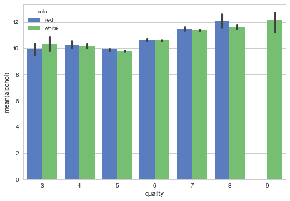


```python
sns.lmplot(data=wine_df, x="quality", y="alcohol", hue="color")
```


    <seaborn.axisgrid.FacetGrid at 0x118bd3160>


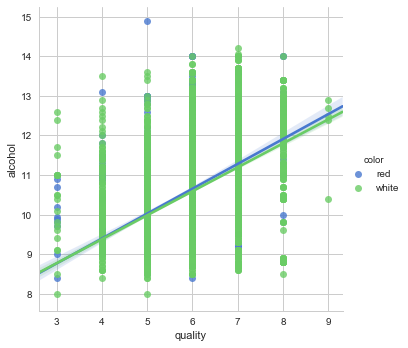


#### Alcohol to Quality relation for Wines equal or greater than 7


```python
hq_wines = wine_df[wine_df.quality >= 7]
sns.lmplot(data=hq_wines, x="quality", y="alcohol", hue="color")
sns.plt.title("Quality >= 7")
```


    <matplotlib.text.Text at 0x118fe82e8>


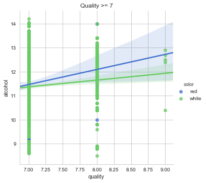


## Heatmap Alcohol to Quality


```python
heat_table = wine_df[["quality", "alcohol"]].copy()
heat_table["alcohol"] = heat_table.alcohol.apply(func=lambda x: round(x * 2) / 2)
heat_table = heat_table.groupby(["quality", "alcohol"])["alcohol"].count().reset_index(name='counts')
sns.heatmap(heat_table.pivot("quality", "alcohol", "counts"))
```


    <matplotlib.axes._subplots.AxesSubplot at 0x118e0eb70>


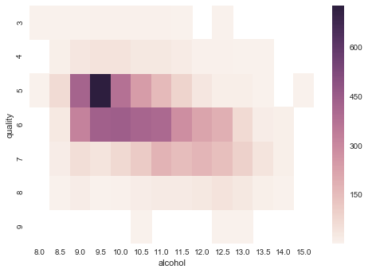


# Chlorides


```python
sns.barplot(data=wine_df, hue="color", x="quality", y="chlorides")
```


    <matplotlib.axes._subplots.AxesSubplot at 0x1192a8c18>


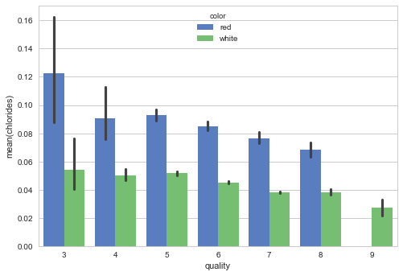


__The less chlorides in a wine the higher the quality.__

## Chlorides and Alcohol


```python
g = sns.PairGrid(wine_df[["alcohol", "chlorides", "quality"]], hue="quality")
g = g.map_diag(plt.hist)
g = g.map_offdiag(plt.scatter)
g = g.add_legend()
```


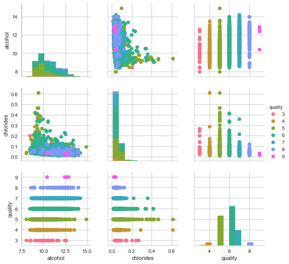


## Acids


```python
sns.pairplot(white_wine_df[["volatile acidity", "citric acid", "quality"]], hue="quality")
```


    <seaborn.axisgrid.PairGrid at 0x1194682b0>


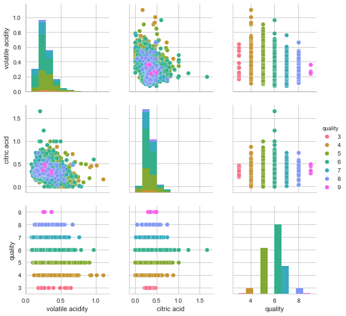


## Bringing the relevant attributes together


```python
sns.pairplot(white_wine_df[["volatile acidity", "citric acid", "quality", "free sulfur dioxide", "chlorides"]], hue="quality")
```


    <seaborn.axisgrid.PairGrid at 0x11a544128>


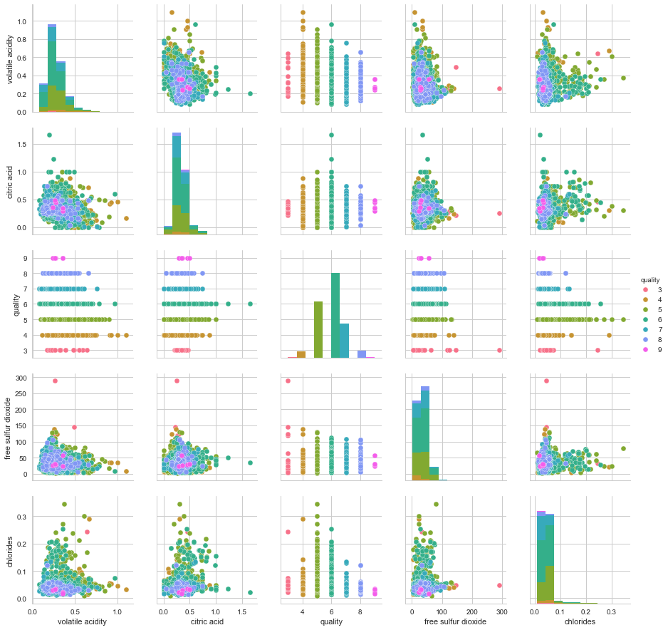


```python
white_wine_df[["volatile acidity", "citric acid", "quality"]].groupby("quality").describe(percentiles=[])
```


<div>
<table border="1" class="dataframe">
  <thead>
    <tr>
      <th></th>
      <th colspan="6" halign="left">citric acid</th>
      <th colspan="6" halign="left">volatile acidity</th>
    </tr>
    <tr>
      <th></th>
      <th>count</th>
      <th>mean</th>
      <th>std</th>
      <th>min</th>
      <th>50%</th>
      <th>max</th>
      <th>count</th>
      <th>mean</th>
      <th>std</th>
      <th>min</th>
      <th>50%</th>
      <th>max</th>
    </tr>
    <tr>
      <th>quality</th>
      <th></th>
      <th></th>
      <th></th>
      <th></th>
      <th></th>
      <th></th>
      <th></th>
      <th></th>
      <th></th>
      <th></th>
      <th></th>
      <th></th>
    </tr>
  </thead>
  <tbody>
    <tr>
      <th>3</th>
      <td>20.0</td>
      <td>0.336000</td>
      <td>0.081460</td>
      <td>0.21</td>
      <td>0.345</td>
      <td>0.47</td>
      <td>20.0</td>
      <td>0.333250</td>
      <td>0.140827</td>
      <td>0.17</td>
      <td>0.26</td>
      <td>0.640</td>
    </tr>
    <tr>
      <th>4</th>
      <td>163.0</td>
      <td>0.304233</td>
      <td>0.163857</td>
      <td>0.00</td>
      <td>0.290</td>
      <td>0.88</td>
      <td>163.0</td>
      <td>0.381227</td>
      <td>0.173463</td>
      <td>0.11</td>
      <td>0.32</td>
      <td>1.100</td>
    </tr>
    <tr>
      <th>5</th>
      <td>1457.0</td>
      <td>0.337653</td>
      <td>0.140814</td>
      <td>0.00</td>
      <td>0.320</td>
      <td>1.00</td>
      <td>1457.0</td>
      <td>0.302011</td>
      <td>0.100066</td>
      <td>0.10</td>
      <td>0.28</td>
      <td>0.905</td>
    </tr>
    <tr>
      <th>6</th>
      <td>2198.0</td>
      <td>0.338025</td>
      <td>0.119325</td>
      <td>0.00</td>
      <td>0.320</td>
      <td>1.66</td>
      <td>2198.0</td>
      <td>0.260564</td>
      <td>0.088142</td>
      <td>0.08</td>
      <td>0.25</td>
      <td>0.965</td>
    </tr>
    <tr>
      <th>7</th>
      <td>880.0</td>
      <td>0.325625</td>
      <td>0.079183</td>
      <td>0.01</td>
      <td>0.310</td>
      <td>0.74</td>
      <td>880.0</td>
      <td>0.262767</td>
      <td>0.091106</td>
      <td>0.08</td>
      <td>0.25</td>
      <td>0.760</td>
    </tr>
    <tr>
      <th>8</th>
      <td>175.0</td>
      <td>0.326514</td>
      <td>0.085439</td>
      <td>0.04</td>
      <td>0.320</td>
      <td>0.74</td>
      <td>175.0</td>
      <td>0.277400</td>
      <td>0.108029</td>
      <td>0.12</td>
      <td>0.26</td>
      <td>0.660</td>
    </tr>
    <tr>
      <th>9</th>
      <td>5.0</td>
      <td>0.386000</td>
      <td>0.082037</td>
      <td>0.29</td>
      <td>0.360</td>
      <td>0.49</td>
      <td>5.0</td>
      <td>0.298000</td>
      <td>0.057619</td>
      <td>0.24</td>
      <td>0.27</td>
      <td>0.360</td>
    </tr>
  </tbody>
</table>
</div>


```python
white_wine_df[["quality", "free sulfur dioxide", "chlorides"]].groupby("quality").describe(percentiles=[])
```


<div>
<table border="1" class="dataframe">
  <thead>
    <tr>
      <th></th>
      <th colspan="6" halign="left">chlorides</th>
      <th colspan="6" halign="left">free sulfur dioxide</th>
    </tr>
    <tr>
      <th></th>
      <th>count</th>
      <th>mean</th>
      <th>std</th>
      <th>min</th>
      <th>50%</th>
      <th>max</th>
      <th>count</th>
      <th>mean</th>
      <th>std</th>
      <th>min</th>
      <th>50%</th>
      <th>max</th>
    </tr>
    <tr>
      <th>quality</th>
      <th></th>
      <th></th>
      <th></th>
      <th></th>
      <th></th>
      <th></th>
      <th></th>
      <th></th>
      <th></th>
      <th></th>
      <th></th>
      <th></th>
    </tr>
  </thead>
  <tbody>
    <tr>
      <th>3</th>
      <td>20.0</td>
      <td>0.054300</td>
      <td>0.046468</td>
      <td>0.022</td>
      <td>0.041</td>
      <td>0.244</td>
      <td>20.0</td>
      <td>53.325000</td>
      <td>69.420776</td>
      <td>5.0</td>
      <td>33.5</td>
      <td>289.0</td>
    </tr>
    <tr>
      <th>4</th>
      <td>163.0</td>
      <td>0.050098</td>
      <td>0.025888</td>
      <td>0.013</td>
      <td>0.046</td>
      <td>0.290</td>
      <td>163.0</td>
      <td>23.358896</td>
      <td>20.391349</td>
      <td>3.0</td>
      <td>18.0</td>
      <td>138.5</td>
    </tr>
    <tr>
      <th>5</th>
      <td>1457.0</td>
      <td>0.051546</td>
      <td>0.026496</td>
      <td>0.009</td>
      <td>0.047</td>
      <td>0.346</td>
      <td>1457.0</td>
      <td>36.432052</td>
      <td>18.145991</td>
      <td>2.0</td>
      <td>35.0</td>
      <td>131.0</td>
    </tr>
    <tr>
      <th>6</th>
      <td>2198.0</td>
      <td>0.045217</td>
      <td>0.020453</td>
      <td>0.015</td>
      <td>0.043</td>
      <td>0.255</td>
      <td>2198.0</td>
      <td>35.650591</td>
      <td>15.735679</td>
      <td>3.0</td>
      <td>34.0</td>
      <td>112.0</td>
    </tr>
    <tr>
      <th>7</th>
      <td>880.0</td>
      <td>0.038191</td>
      <td>0.010697</td>
      <td>0.012</td>
      <td>0.037</td>
      <td>0.135</td>
      <td>880.0</td>
      <td>34.125568</td>
      <td>13.244737</td>
      <td>5.0</td>
      <td>33.0</td>
      <td>108.0</td>
    </tr>
    <tr>
      <th>8</th>
      <td>175.0</td>
      <td>0.038314</td>
      <td>0.013164</td>
      <td>0.014</td>
      <td>0.036</td>
      <td>0.121</td>
      <td>175.0</td>
      <td>36.720000</td>
      <td>16.203675</td>
      <td>6.0</td>
      <td>35.0</td>
      <td>105.0</td>
    </tr>
    <tr>
      <th>9</th>
      <td>5.0</td>
      <td>0.027400</td>
      <td>0.007436</td>
      <td>0.018</td>
      <td>0.031</td>
      <td>0.035</td>
      <td>5.0</td>
      <td>33.400000</td>
      <td>13.427584</td>
      <td>24.0</td>
      <td>28.0</td>
      <td>57.0</td>
    </tr>
  </tbody>
</table>
</div>


# Final Conclusion

no attribute alone is strong enough to define a high quality wine, but as the figures show. For a wine to score high, having the acids and sulfur dioxide values all within in a certain range can help.

## Best vs. Worst

when comparing the best (8,9) vs. worst (3,4) we can see that they well overlap each other.


```python
qual3 = white_wine_df[white_wine_df["quality"] == 3]
qual4 = white_wine_df[white_wine_df["quality"] == 4].copy()
qual4.quality = 3
qual8 = white_wine_df[white_wine_df["quality"] == 8]
qual9 = white_wine_df[white_wine_df["quality"] == 9].copy()
qual9.quality = 8
white_wine_sample = pd.concat([qual3, qual4, qual8, qual9], ignore_index=True)
white_wine_sample
sns.pairplot(white_wine_sample[["volatile acidity", "citric acid", "quality"]], hue="quality")
```


    <seaborn.axisgrid.PairGrid at 0x11cc89ef0>


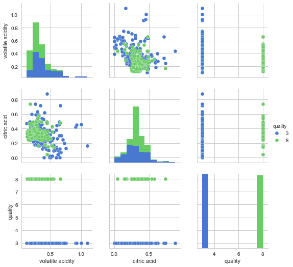


```python
sns.pairplot(white_wine_sample[["volatile acidity", "citric acid", "quality", "sulphates", "chlorides"]], hue="quality")
```


    <seaborn.axisgrid.PairGrid at 0x11d07cb00>


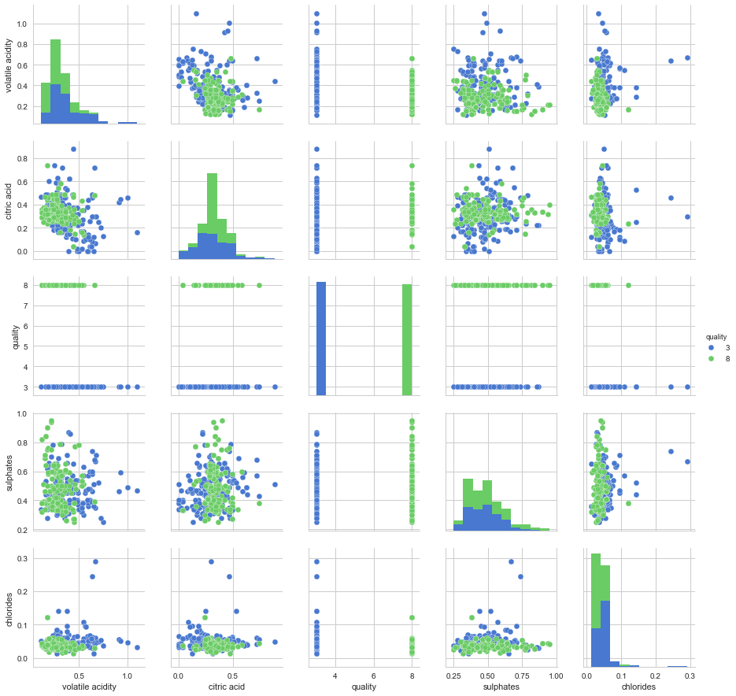


# Seems like labs can't measure a wine's inner spirit (yet).

__But if you have to pick a wine only based on specs, i would suggest white wines close to this values:__


```python
qual8[["quality", "chlorides", "alcohol", "citric acid", "sulphates"]].describe(percentiles=[])
```


<div>
<table border="1" class="dataframe">
  <thead>
    <tr style="text-align: right;">
      <th></th>
      <th>quality</th>
      <th>chlorides</th>
      <th>alcohol</th>
      <th>citric acid</th>
      <th>sulphates</th>
    </tr>
  </thead>
  <tbody>
    <tr>
      <th>count</th>
      <td>175.0</td>
      <td>175.000000</td>
      <td>175.000000</td>
      <td>175.000000</td>
      <td>175.000000</td>
    </tr>
    <tr>
      <th>mean</th>
      <td>8.0</td>
      <td>0.038314</td>
      <td>11.636000</td>
      <td>0.326514</td>
      <td>0.486229</td>
    </tr>
    <tr>
      <th>std</th>
      <td>0.0</td>
      <td>0.013164</td>
      <td>1.280138</td>
      <td>0.085439</td>
      <td>0.147073</td>
    </tr>
    <tr>
      <th>min</th>
      <td>8.0</td>
      <td>0.014000</td>
      <td>8.500000</td>
      <td>0.040000</td>
      <td>0.250000</td>
    </tr>
    <tr>
      <th>50%</th>
      <td>8.0</td>
      <td>0.036000</td>
      <td>12.000000</td>
      <td>0.320000</td>
      <td>0.460000</td>
    </tr>
    <tr>
      <th>max</th>
      <td>8.0</td>
      <td>0.121000</td>
      <td>14.000000</td>
      <td>0.740000</td>
      <td>0.950000</td>
    </tr>
  </tbody>
</table>
</div>


__and red wines close to this values:__


```python
rqual8 = red_wine_df[red_wine_df["quality"] >= 8]
rqual8[["quality", "chlorides", "alcohol", "citric acid", "sulphates"]].describe(percentiles=[])
```


<div>
<table border="1" class="dataframe">
  <thead>
    <tr style="text-align: right;">
      <th></th>
      <th>quality</th>
      <th>chlorides</th>
      <th>alcohol</th>
      <th>citric acid</th>
      <th>sulphates</th>
    </tr>
  </thead>
  <tbody>
    <tr>
      <th>count</th>
      <td>18.0</td>
      <td>18.000000</td>
      <td>18.000000</td>
      <td>18.000000</td>
      <td>18.000000</td>
    </tr>
    <tr>
      <th>mean</th>
      <td>8.0</td>
      <td>0.068444</td>
      <td>12.094444</td>
      <td>0.391111</td>
      <td>0.767778</td>
    </tr>
    <tr>
      <th>std</th>
      <td>0.0</td>
      <td>0.011678</td>
      <td>1.224011</td>
      <td>0.199526</td>
      <td>0.115379</td>
    </tr>
    <tr>
      <th>min</th>
      <td>8.0</td>
      <td>0.044000</td>
      <td>9.800000</td>
      <td>0.030000</td>
      <td>0.630000</td>
    </tr>
    <tr>
      <th>50%</th>
      <td>8.0</td>
      <td>0.070500</td>
      <td>12.150000</td>
      <td>0.420000</td>
      <td>0.740000</td>
    </tr>
    <tr>
      <th>max</th>
      <td>8.0</td>
      <td>0.086000</td>
      <td>14.000000</td>
      <td>0.720000</td>
      <td>1.100000</td>
    </tr>
  </tbody>
</table>
</div>
